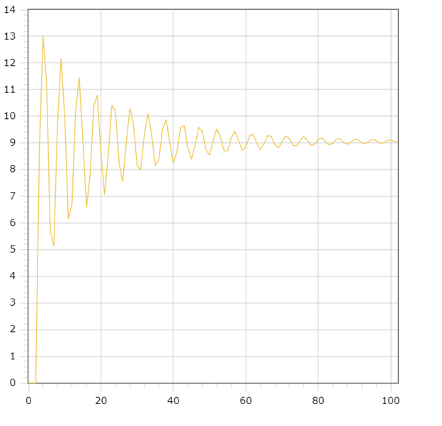

<p align="center">Министерство образования Республики Беларусь</p>
<p align="center">Учреждение образования</p>
<p align="center">"Брестский Государственный технический университет"</p>
<p align="center">Кафедра ИИТ</p>
<br>
<br>
<p align="center">Лабораторная работа №2</p>
<p align="center">По дисциплине: "Общая теория интеллектуальных систем"</p>
<p align="center">Тема: "ПИД-регуляторы"</p>
<br>
<br>
<p align="right">Выполнил:<br>Студент 2 курса<br>Группы ИИ-24<br>Мшар В. В.</p>
<p align="right">Проверил:<br>Иванюк Д. С.</p>
<br>
<p align="center">Брест 2023</p>

---

# Общее задание #
1. Написать отчет по выполненной лабораторной работе №2 в .md формате (*readme.md*) и с помощью **pull request** разместить его в следующем каталоге: **trunk\ii0xxyy\task_02\doc**.
2. Исходный код написанной программы разместить в каталоге: **trunk\ii00xxyy\task_02\src**.
---

# Выполнение задания #

Код программы:
```C++

#include <iostream>
#include <cmath>
#include <vector>

using namespace std;

class Func {
private:
    double K;
    double T;
    double T_D;
    double T_0;

    double q_0;
    double q_1;
    double q_2;

    vector<double> q;
    vector<double> e;
    vector<double> y;
    vector<double> u;

public:
    Func(double k, double t, double tD, double t0)
        : K(k), T(t), T_D(tD), T_0(t0), q_0(K* (1 + T_D / T_0)),
        q_1(-K * (1 + 2 * T_D / T_0 - T_0 / T)), q_2(K* T_D / T_0),
        q({ q_0, q_1, q_2 }), e({ 0, 0, 0 }), y({ 0, 0, 0 }), u({ 1, 1 }) {}

    double sum() {
        double sum = 0;
        for (int i = 0; i < 3; i++) {
            sum += q[i] * e[i];
        }
        return sum;
    }

    void nonlin(int time, double setpoint, double a = 0.5, double b = 0.3, double c = 0.9, double d = 0.7) {
        for (int i = 0; i < time; i++) {
            e[0] = setpoint - y[y.size() - 1];
            e[1] = setpoint - y[y.size() - 2];
            e[2] = setpoint - y[y.size() - 3];
            u[0] = u[1] + sum();
            y.push_back(a * y[y.size() - 1] - b * y[y.size() - 2] * y[y.size() - 2] + c * u[0] + d * sin(u[1]));
            u[1] = u[0];
        }
    }

    vector<double> getY() const {
        return y;
    }
};

int main() {
    double setpoint;
    Func f(0.0001, 100, 100, 1);

    cout << "Enter the setpoint: ";
    cin >> setpoint;
    f.nonlin(100, setpoint);
    vector<double> y_values = f.getY();

    for (int i = 0; i < y_values.size(); i++) {
        double scaledValue = y_values[i] * setpoint / y_values[y_values.size() - 1];
        cout << i << " " << scaledValue << endl;
    }

    return 0;
}
```
Вывод программы:
```
Enter the setpoint: 9
0 0
1 0
2 0
3 8.72269
4 13.0048
5 11.2553
6 5.68712
7 5.13458
8 9.65908
9 12.1627
10 9.98522
11 6.14853
12 6.73315
13 10.1621
14 11.4484
15 9.1329
16 6.59238
17 7.77869
18 10.3852
19 10.7882
20 8.57952
21 7.07022
22 8.51016
23 10.4106
24 10.1964
25 8.2651
26 7.54921
27 9.01295
28 10.3004
29 9.69577
30 8.13786
31 7.99401
32 9.33593
33 10.107
34 9.30096
35 8.14668
36 8.37993
37 9.51687
38 9.87449
39 9.01482
40 8.24387
41 8.69397
42 9.58915
43 9.63765
44 8.82967
45 8.38896
46 8.93282
47 9.58315
48 9.42115
49 8.73044
50 8.5507
51 9.10041
52 9.52585
53 9.24002
54 8.6982
55 8.70711
56 9.20539
57 9.44012
58 9.10092
59 8.71343
60 8.84446
61 9.25908
62 9.34406
63 9.00408
64 8.75827
65 8.95569
66 9.2737
67 9.25087
68 8.94523
69 8.81798
70 9.03872
71 9.26108
72 9.16909
73 8.91759
74 8.88136
75 9.09494
76 9.23173
77 9.10328
78 8.91342
79 8.94073
80 9.12791
81 9.1943
82 9.05482
83 8.92515
84 8.99144
85 9.14223
86 9.15535
87 9.02284
88 8.94619
89 9.03134
90 9.14284
91 9.11938
92 9.00505
93 8.97121
94 9.0601
95 9.13434
96 9.08908
97 8.99847
98 8.99633
99 9.07862
100 9.1207
101 9.06566
102 9
```
